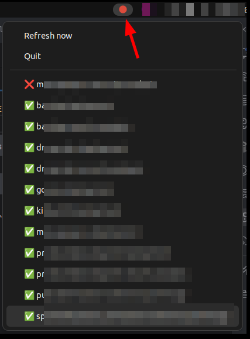

# GitHub Actions Tray Monitor

Linux tray utility that monitors GitHub Actions workflows and shows CI/CD health at a glance.

- Green icon: all configured builds are passing
- Red icon: at least one build failed
- Yellow icon: running, unknown, or API issues
- Blinking yellow icon: refresh in progress
- Click tray icon: opens dropdown with `Refresh now`, `Reload Config`, `Quit`, and all configured builds



## Table of Contents

- [What You Get](#what-you-get)
- [Requirements](#requirements)
- [Clone](#clone)
- [Install](#install)
- [Configuration](#configuration)
- [GitHub Token](#github-token)
- [Running the Tray](#running-the-tray)
- [CLI (`--check-once`) Reference](#cli---check-once-reference)
- [Autostart with systemd (User Service)](#autostart-with-systemd-user-service)
- [Build, Reinstall, Restart (Local Dev)](#build-reinstall-restart-local-dev)
- [Test](#test)
- [Troubleshooting](#troubleshooting)
- [License](#license)

## What You Get

- Multiple workflow monitoring from JSON config
- Clickable build entries in the tray menu (opens latest run/workflow URL)
- `--check-once` mode for scripts, cron jobs, and CI
- Optional JSON output for automation
- User-level systemd service support

## Requirements

- Linux desktop session with tray support (StatusNotifier/AppIndicator)
- Python 3.10+

Ubuntu 22.04 (GNOME) dependencies:

```bash
sudo apt update
sudo apt install -y gnome-shell-extension-appindicator libxcb-cursor0
```

If the tray icon does not show, log out/in once.

Other distros (for Qt xcb runtime issues):

- Fedora: `sudo dnf install -y xcb-util-cursor`
- Arch: `sudo pacman -S xcb-util-cursor`
- openSUSE: `sudo zypper install -y libxcb-cursor0`

## Clone

```bash
git clone https://github.com/niesfisch/build-monitor.git
cd build-monitor
```

## Install

### Quick Start (Recommended)

Create a virtualenv and install the package in editable mode:

```bash
python3 -m venv .venv
source .venv/bin/activate
python -m pip install --upgrade pip
pip install -e '.[test]'
```

### Install Variants

Use the variant that fits your workflow:

| Variant | Best for | Install command | Run command |
|---|---|---|---|
| `pipx` | daily local usage, isolated tool install | `pipx install .` | `gha-tray-monitor` |
| virtualenv editable | active development | `pip install -e '.[test]'` | `gha-tray-monitor` |
| wheel (`dist/*.whl`) | release-like install/testing artifacts | `python -m build && pip install dist/*.whl` | `gha-tray-monitor` |
| module run | quick local source run, no entrypoint needed | no install required | `python -m gha_tray_monitor` |

## Configuration

On first run, a default config is created at:

`~/.config/gha-tray-monitor/config.json`

Example:

```json
{
  "poll_interval_seconds": 60,
  "github_token_env": "GITHUB_TOKEN",
  "builds": [
    {
      "name": "Build Monitor",
      "url": "https://github.com/niesfisch/build-monitor/actions/workflows/ci.yml",
      "branch": "main"
    }
  ]
}
```

Config fields:

- `poll_interval_seconds`: tray refresh interval in seconds (minimum `10`)
- `github_token_env`: env var name containing the GitHub token (for example `GITHUB_TOKEN`)
- `show_builds`: default `--check-once` output filter: `all`, `failed`, `failed+running`
- `builds`: list of workflows to monitor
  - `name`: label in tray/CLI
  - `url`: workflow URL
  - `branch` (optional): filter runs to a branch

Supported workflow URL format:

`https://github.com/<owner>/<repo>/actions/workflows/<workflow-file-or-id>`

Examples:

- `https://github.com/acme/api/actions/workflows/ci.yml`
- `https://github.com/acme/api/actions/workflows/12345678`

## GitHub Token

For private repos and better rate limits, export a token with repo read access:

```bash
export GITHUB_TOKEN="<your-token>"
```

Important: config expects the *variable name* (`github_token_env`), not the token value.

## Running the Tray

Verify your setup first with a one-shot CLI check:

```bash
gha-tray-monitor --check-once --show all
```

Start the tray icon (terminal stays attached):

```bash
gha-tray-monitor
```

Start the tray icon in the background and return to your shell immediately:

```bash
gha-tray-monitor --background
gha-tray-monitor --background --config /path/to/config.json
```

Startup and runtime logs are written to:

`~/.local/state/gha-tray-monitor/tray.log`

> **Note:** Do not use `--background` inside the systemd service. The service should run in the foreground so systemd can supervise it.

## CLI (`--check-once`) Reference

Base check:

```bash
gha-tray-monitor --check-once
```

Custom config:

```bash
gha-tray-monitor --check-once --config /path/to/config.json
```

Output variants:

```bash
gha-tray-monitor --check-once --show all
gha-tray-monitor --check-once --show failed
gha-tray-monitor --check-once --show failed+running
```

JSON output:

```bash
gha-tray-monitor --check-once --json
gha-tray-monitor --check-once --json --show failed+running
```

Exit codes:

- `0` = green
- `1` = yellow
- `2` = red

## Autostart with systemd (User Service)

Create a token env file so the service picks up your GitHub token:

```bash
mkdir -p ~/.config/gha-tray-monitor
cat > ~/.config/gha-tray-monitor/env <<'EOF'
GITHUB_TOKEN=your_token_here
EOF
chmod 600 ~/.config/gha-tray-monitor/env
```

If you installed into a venv, create a stable launcher symlink that survives reinstalls:

```bash
mkdir -p ~/.local/bin
ln -sfn "$PWD/.venv/bin/gha-tray-monitor" ~/.local/bin/gha-tray-monitor
```

Create `~/.config/systemd/user/gha-tray-monitor.service`:

```ini
[Unit]
Description=GitHub Actions Tray Monitor
After=graphical-session.target
Wants=graphical-session.target

[Service]
Type=simple
ExecStart=%h/.local/bin/gha-tray-monitor
Restart=on-failure
RestartSec=10
EnvironmentFile=%h/.config/gha-tray-monitor/env

[Install]
WantedBy=default.target
```

Enable and verify:

```bash
systemctl --user daemon-reload
systemctl --user enable --now gha-tray-monitor.service
systemctl --user status gha-tray-monitor.service
journalctl --user -u gha-tray-monitor.service -f
```

## Build, Reinstall, Restart (Local Dev)

Use the helper script to recreate `.venv` when missing, rebuild the wheel, reinstall into `.venv`, refresh the launcher symlink, and restart the user service:

```bash
./scripts/rebuild-and-reload.sh
```

Manual equivalent:

```bash
python3 -m venv .venv
.venv/bin/python -m pip install --upgrade pip build
rm -f dist/*.whl
.venv/bin/python -m build
.venv/bin/pip install --force-reinstall dist/*.whl
mkdir -p ~/.local/bin
ln -sfn "$PWD/.venv/bin/gha-tray-monitor" ~/.local/bin/gha-tray-monitor
systemctl --user daemon-reload
systemctl --user restart gha-tray-monitor.service
```

Tip: `./scripts/rebuild-and-reload.sh` recreates `.venv` if needed and refreshes the symlink automatically, which avoids stale paths after moving the repo.

## Test

```bash
python -m pip install -e '.[test]'
pytest
```

## Troubleshooting

- Qt xcb plugin error: install the distro package listed in [Requirements](#requirements)
- Tray icon missing in GNOME: verify the AppIndicator extension is enabled and re-login
- Private repo returns 404: verify token scope, env var name, and workflow URL format

## License

MIT. See `LICENSE`.

# For me

```bash
#GIT_SSH_COMMAND='ssh -i ~/.ssh/niesfisch' git remote add origin git@github.com:niesfisch/build-monitor.git
#GIT_SSH_COMMAND='ssh -i ~/.ssh/niesfisch' git branch -M main
#GIT_SSH_COMMAND='ssh -i ~/.ssh/niesfisch' git push -u origin main
GIT_SSH_COMMAND='ssh -i ~/.ssh/niesfisch' git pull  
GIT_SSH_COMMAND='ssh -i ~/.ssh/niesfisch' git push origin main  
```